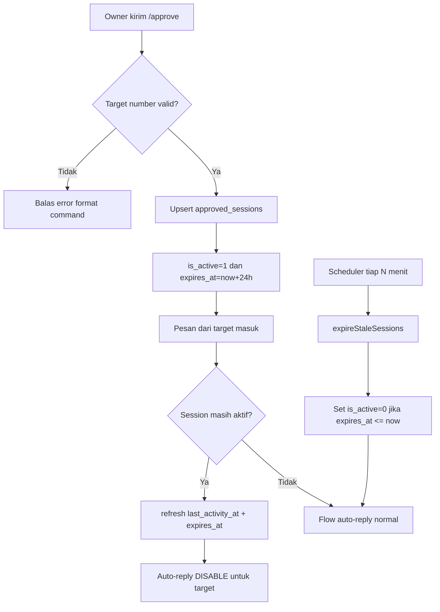

<div align="center">

# 🤖 WA Auto-Reply Bot

[](https://github.com/el-pablos/wa-autoreply-bot/actions)
[](https://github.com/el-pablos/wa-autoreply-bot/releases)
[](LICENSE)
[](https://php.net)
[](https://nodejs.org)
[](https://docker.com)
[](https://mysql.com)

**Bot WhatsApp auto-reply berbasis Baileys dengan dashboard monitoring Laravel — dijalankan full via Docker.**

[🚀 Demo](#) · [📖 Dokumentasi](#cara-install) · [🐛 Laporkan Bug](https://github.com/el-pablos/wa-autoreply-bot/issues)


</div>

---

## 📖 Deskripsi Proyek

WA Auto-Reply Bot adalah sistem auto-responder WhatsApp yang dibangun di atas library **Baileys** (Node.js), dikombinasikan dengan dashboard monitoring berbasis **Laravel** yang bisa diakses lewat browser. Semua komponen dijalankan di dalam **Docker**, jadi gampang banget buat start, stop, dan restart.

Singkatnya, kalau ada yang WA kamu dan nomornya ada di **allow-list**, bot akan otomatis bales dengan pesan custom yang bisa kamu ubah kapan aja dari dashboard. Cocok buat kamu yang sering offline atau lagi sibuk tapi nggak mau ninggalin orang nunggu tanpa kabar.

**Kenapa pakai sistem ini?**

- **Tidak perlu server WA berbayar** — Baileys jalan langsung di Node.js, gratis
- **Full kontrol** — kamu tentukan siapa yang dapat auto-reply lewat allow-list
- **Dashboard real-time** — lihat semua pesan masuk, statistik, dan ubah pengaturan tanpa restart bot
- **Portable** — Docker compose, tinggal `up -d` dan jalan

---

## 🏗️ Arsitektur Proyek

```
┌─────────────────────────────────────────────────────────────┐
│                        INTERNET                             │
└─────────────────┬───────────────────────────────────────────┘
                  │
        ┌─────────▼──────────┐
        │  WhatsApp Network  │
        │  (Baileys WS)      │
        └─────────┬──────────┘
                  │ WebSocket
        ┌─────────▼──────────────────────────────────────────┐
        │              Docker Network                        │
        │                                                    │
        │  ┌──────────────┐    ┌────────────────────────┐   │
        │  │  wa-bot      │    │  wa-dashboard           │   │
        │  │  (Node.js)   │◄──►│  (Laravel + PHP-FPM)   │   │
        │  │  port 3001   │    │  port 80 → 8002         │   │
        │  └──────┬───────┘    └──────────┬─────────────┘   │
        │         │                       │                  │
        │         └──────────┬────────────┘                  │
        │                    │                               │
        │           ┌────────▼────────┐                      │
        │           │   wa-mysql      │                      │
        │           │  (MySQL 8.0)    │                      │
        │           │  port 3307      │                      │
        │           └─────────────────┘                      │
        └────────────────────────────────────────────────────┘
                  │
        ┌─────────▼──────────┐
        │  Nginx + Certbot   │
        │  monitoring-wa     │
        │  .tams.codes       │
        └────────────────────┘
```

### Alur Kerja Bot

```
Pesan WA Masuk
      │
      ▼
Apakah msg.key.fromMe? ──YES──► Abaikan
      │ NO
      ▼
Apakah dari grup?
      │ YES
      ▼
ignore_groups = true? ──YES──► Log saja, tidak reply
      │ NO
      │
      ▼ (private / grup dengan ignore=false)
Resolve sender ke nomor WA format 62...
      │
      ├──GAGAL RESOLVE──► Log unresolved, tidak reply
      │
      └──BERHASIL RESOLVE──►
            │
            ▼
      Cek approved session aktif?
            │ YES
            ▼
      Refresh rolling expiry (last_activity + expires_at)
            │
            ▼
      Skip auto-reply (owner handle manual)
            │
            └──NO──► Cek allow-list MySQL
                      │
                      ├──NOT FOUND──► Log (is_allowed=false, replied=false)
                      │
                      └──FOUND──► auto_reply_enabled = true?
                                │ NO──► Log (is_allowed=true, replied=false)
                                │ YES
                                ▼
                          Tunggu reply_delay_ms
                                │
                                ▼
                          sock.sendMessage(pesan dari DB)
                                │
                                ▼
                          Log (is_allowed=true, replied=true)
```

### Alur Khusus Fitur `/approve` (Mermaid)



---

## 📊 ERD Database

```
┌─────────────────────────────┐
│       allowed_numbers       │
├─────────────────────────────┤
│ id            INT PK AI     │
│ phone_number  VARCHAR(20) UQ│
│ label         VARCHAR(100)  │
│ is_active     TINYINT(1)    │
│ created_at    TIMESTAMP     │
│ updated_at    TIMESTAMP     │
└─────────────────────────────┘

┌─────────────────────────────┐
│        message_logs         │
├─────────────────────────────┤
│ id            BIGINT PK AI  │
│ from_number   VARCHAR(64)   │
│ message_text  TEXT          │
│ message_type  VARCHAR(30)   │
│ is_allowed    TINYINT(1)    │
│ replied       TINYINT(1)    │
│ reply_text    TEXT          │
│ group_id      VARCHAR(50)   │
│ received_at   TIMESTAMP     │
└─────────────────────────────┘

┌─────────────────────────────┐
│        bot_settings         │
├─────────────────────────────┤
│ key           VARCHAR(60) PK│
│ value         TEXT          │
│ description   VARCHAR(255)  │
│ updated_at    TIMESTAMP     │
└─────────────────────────────┘

┌─────────────────────────────┐
│      approved_sessions      │
├─────────────────────────────┤
│ id            INT PK AI     │
│ phone_number  VARCHAR(20)   │
│ approved_at   TIMESTAMP     │
│ last_activity_at TIMESTAMP  │
│ expires_at    TIMESTAMP     │
│ is_active     TINYINT(1)    │
│ approved_by   VARCHAR(20)   │
│ revoked_at    TIMESTAMP NULL│
└─────────────────────────────┘
```

---

## 🛠️ Tech Stack

| Komponen | Teknologi | Keterangan |
|---|---|---|
| **WA Bot** | Node.js 20 + Baileys | Koneksi WhatsApp via WebSocket |
| **Dashboard** | Laravel 11 + PHP 8.3 | Web monitoring & manajemen |
| **Database** | MySQL 8.0 | Shared DB antara bot & dashboard |
| **Container** | Docker + Compose | Orkestrasi semua service |
| **Web Server** | Nginx | Reverse proxy + SSL termination |
| **SSL** | Let's Encrypt (Certbot) | HTTPS otomatis |
| **DNS** | Cloudflare | DNS management |
| **CI/CD** | GitHub Actions | Auto test, build, release |

---

## ✨ Fitur Lengkap

### 🤖 Bot (Node.js + Baileys)
- ✅ Auto-reply ke nomor yang ada di allow-list
- ✅ QR code endpoint di `/qr` untuk scan pertama kali
- ✅ Health check endpoint di `/health`
- ✅ Auto-reconnect jika koneksi terputus
- ✅ Command owner: `/approve`, `/revoke`, `/status`, `/help`
- ✅ Session bypass auto-reply per nomor (rolling expiry)
- ✅ Scheduler auto-expire untuk mengaktifkan auto-reply kembali
- ✅ Support berbagai tipe pesan (teks, gambar, video, audio, sticker, lokasi, kontak)
- ✅ Configurable delay sebelum reply (biar keliatan natural)
- ✅ Toggle ignore pesan dari grup
- ✅ Update status bot di database (online/offline/connecting)
- ✅ Graceful shutdown

### 📊 Dashboard (Laravel)
- ✅ Login dengan password sederhana (single-user)
- ✅ Dashboard dengan statistik real-time
- ✅ Chart pesan 7 hari terakhir
- ✅ Allow-list CRUD (tambah, edit, hapus, toggle aktif)
- ✅ Halaman Approved Sessions (active + history)
- ✅ Tombol manual revoke session approve
- ✅ Filter & search allow-list
- ✅ Log viewer dengan filter lengkap (nomor, status reply, tanggal)
- ✅ Halaman pengaturan (ubah pesan reply, delay, toggle auto-reply)
- ✅ Mobile-First responsive design
- ✅ Dark mode by default

### 🔧 DevOps
- ✅ Docker Compose untuk development dan production
- ✅ Health check untuk semua service
- ✅ GitHub Actions CI/CD
- ✅ Auto-release dengan semantic versioning
- ✅ SSL otomatis dengan Certbot
- ✅ Cloudflare DNS management

---

## 🆕 Fitur `/approve` + Auto-Expiry Session (Detail Lengkap)

Fitur `/approve` dibuat buat problem yang bener-bener real: saat auto-reply aktif, kamu kadang pengen handle satu chat secara manual tanpa gangguan bot. Kalau kamu matiin auto-reply secara global, dampaknya ke semua nomor dan itu sering nggak ideal. Kalau dibiarkan aktif, bot bakal tetap balas padahal kamu lagi ngobrol langsung. Solusi paling aman adalah bypass berbasis nomor dengan masa berlaku otomatis — itulah yang dilakukan fitur ini.

Begitu owner mengirim command `/approve` untuk target tertentu, sistem membuat sesi approve di tabel `approved_sessions`. Selama sesi itu aktif, bot **tetap menerima dan mencatat pesan** dari target, tapi **tidak mengirim auto-reply** ke nomor tersebut. Jadi observability tetap jalan, logging tetap utuh, tapi kontrol percakapan dipindah ke owner.

Nilai paling penting dari implementasi ini ada di mekanisme **rolling expiry**. Expiry bukan dihitung sekali dari waktu approve awal. Sebaliknya, setiap kali ada pesan baru dari nomor yang sedang approved, sistem otomatis memperbarui `last_activity_at` dan mendorong `expires_at` ke depan (`last_activity + N jam`). Akibatnya, sesi tetap aktif selama percakapan masih hidup, dan baru benar-benar berakhir kalau tidak ada aktivitas selama full durasi expiry.

Contoh sederhana:

1. 08:00 owner kirim `/approve 628xxxx`.
2. 08:10 target kirim pesan lagi → expiry geser ke besok 08:10.
3. 12:30 target kirim lagi → expiry geser ke besok 12:30.
4. Kalau setelah itu tidak ada pesan sampai lewat 24 jam, scheduler menandai sesi sebagai expired.

Dengan cara ini, owner nggak perlu spam approve berulang kali selama chat masih berjalan.

### Kontrol akses command owner

Semua command approve/revoke/status/help dibatasi untuk owner. Deteksinya:

- `msg.key.fromMe === true` (umumnya saat command dikirim dari akun WA yang sedang dipakai bot), atau
- nomor pengirim cocok dengan `OWNER_NUMBER`.

Model ini menjaga agar user biasa tidak bisa memanipulasi status approve.

### Command reference

| Command | Fungsi | Cara pakai |
|---|---|---|
| `/approve` | Approve via quote/reply | Reply pesan target lalu kirim command |
| `/approve 628xxx` | Approve eksplisit | Langsung tulis nomor target |
| `/revoke 628xxx` | Cabut session lebih cepat | Auto-reply aktif lagi saat itu juga |
| `/status` | Lihat sesi approve aktif | Menampilkan nomor + waktu expiry |
| `/help` | Tampilkan bantuan command | Referensi cepat |

### Behavior runtime saat pesan masuk

Saat pesan masuk dari nomor yang berhasil di-resolve:

1. Bot cek apakah nomor ada di `approved_sessions` aktif dan belum expired.
2. Kalau iya, bot refresh rolling expiry.
3. Bot skip auto-reply.
4. Bot tetap simpan ke `message_logs`.

Kalau tidak approved, flow lanjut normal ke allow-list + auto-reply settings.

### Scheduler dan expiry otomatis

Scheduler berjalan periodik berdasarkan setting `approve_expire_check_interval_minutes` (default 5). Pada setiap tick, scheduler menjalankan query expire untuk sesi yang `expires_at <= now`. Sesudah status sesi jadi tidak aktif, nomor tersebut langsung kembali mengikuti kebijakan auto-reply biasa.

Karena data persist di MySQL, status approve tidak hilang saat bot restart. Begitu bot hidup lagi, scheduler kembali mengambil state dari DB.

### Integrasi dashboard

Dashboard sekarang punya halaman **Approved Sessions** dengan dua bagian:

- **Sesi Aktif**: daftar nomor yang sedang dalam mode bypass auto-reply.
- **Riwayat**: sesi yang di-revoke manual atau sudah lewat expiry.

Admin juga bisa revoke dari dashboard, sehingga kalau percakapan manual selesai lebih cepat, owner tinggal klik sekali tanpa menunggu timeout.

### Kenapa desain ini aman buat sistem existing

Desain approve tidak mengganti fondasi allow-list. Ia hanya menambah lapisan “temporary bypass”. Jadi:

- allow-list tetap valid sebagai aturan dasar eligibility auto-reply,
- `/approve` hanya meng-override sementara,
- saat sesi habis, sistem otomatis kembali ke baseline tanpa migrasi perilaku tambahan.

Ini membuat fitur baru bisa ditambahkan tanpa merusak alur lama.

### Catatan operasional penting

- Isi `OWNER_NUMBER` wajib format `628...` tanpa `+`.
- Kalau owner number kosong, command owner-by-number tidak bisa dipakai.
- Gunakan `/status` buat audit cepat sesi aktif dari chat WA.
- Gunakan revoke manual kalau perlu mengakhiri bypass lebih cepat.

---

## 📚 Referensi Data Model `approved_sessions`

Tabel `approved_sessions` dipakai sebagai source of truth mode bypass auto-reply.

| Kolom | Tipe | Fungsi |
|---|---|---|
| `id` | `INT UNSIGNED` | PK sesi approve |
| `phone_number` | `VARCHAR(20)` | Nomor target (`628...`) |
| `approved_at` | `TIMESTAMP` | Waktu approve pertama untuk sesi ini |
| `last_activity_at` | `TIMESTAMP` | Waktu aktivitas terbaru dari target |
| `expires_at` | `TIMESTAMP` | Batas akhir sesi (rolling) |
| `is_active` | `TINYINT(1)` | Penanda aktif/nonaktif |
| `approved_by` | `VARCHAR(20)` | Nomor owner yang melakukan approve |
| `revoked_at` | `TIMESTAMP NULL` | Waktu revoke manual |

Index yang disiapkan:

- `(phone_number, is_active)` untuk lookup cepat saat bot memproses pesan masuk,
- `expires_at` untuk scheduler expire,
- `is_active` untuk filter list aktif/riwayat,
- `approved_at` untuk sorting list terbaru.

---

## 🧪 Skenario Uji End-to-End yang Direkomendasikan

Berikut skenario uji minimum biar fitur approve aman dipakai di production:

### 1) Uji command owner

1. Kirim `/help` dan pastikan daftar command tampil.
2. Kirim `/status` saat belum ada sesi aktif, pastikan empty state.
3. Kirim `/approve 628target`.
4. Kirim `/status`, pastikan target tampil sebagai sesi aktif.
5. Kirim `/revoke 628target`, lalu cek `/status` lagi.

### 2) Uji rolling expiry

1. Approve nomor target.
2. Catat `expires_at`.
3. Kirim pesan baru dari target.
4. Verifikasi `expires_at` bergerak maju.
5. Ulangi beberapa kali untuk memastikan rolling bekerja konsisten.

### 3) Uji scheduler expire

1. Atur expiry pendek untuk testing (mis. 1 jam atau simulasikan SQL).
2. Biarkan sesi lewat dari `expires_at`.
3. Pastikan scheduler menonaktifkan sesi.
4. Uji ulang nomor tersebut: harus kembali ke flow auto-reply normal.

### 4) Uji dashboard approve page

1. Buka halaman Approved Sessions.
2. Verifikasi active list dan history list tampil.
3. Coba revoke dari UI.
4. Pastikan row pindah state dan flash message muncul.

### 5) Uji regresi behavior lama

1. Nomor allow-list tanpa approve: harus auto-reply.
2. Nomor allow-list dengan approve aktif: tidak auto-reply.
3. Nomor non-allow-list: tidak auto-reply.

Kalau lima skenario ini lulus, biasanya core logic approve sudah aman buat dijalankan.

---

## 🚀 Cara Install

### Prerequisite

- Docker & Docker Compose
- Git
- Domain dengan Cloudflare (untuk production)

### Environment penting (WAJIB dicek)

| File | Key | Kegunaan |
|---|---|---|
| `bot/.env` | `OWNER_NUMBER` | Nomor owner yang boleh kirim command `/approve` |
| `bot/.env` | `DB_HOST`, `DB_PORT`, `DB_NAME`, `DB_USER`, `DB_PASSWORD` | Koneksi DB untuk bot |
| `dashboard/.env` | `APP_KEY` | Kunci enkripsi aplikasi Laravel |
| `dashboard/.env` | `DASHBOARD_PASSWORD` | Password login dashboard |
| `docker-compose.yml` | Port mappings | Jalur akses service dari host/VPS |

Format `OWNER_NUMBER` harus `628xxx` tanpa simbol plus, tanpa spasi, dan tanpa strip.

### Development (Lokal)

```bash
# 1. Clone repo
git clone https://github.com/el-pablos/wa-autoreply-bot.git
cd wa-autoreply-bot

# 2. Setup env
cp bot/.env.example bot/.env
cp dashboard/.env.example dashboard/.env

# 3. Edit env (isi credential yang dibutuhkan)
nano bot/.env
nano dashboard/.env

# 4. Jalankan semua service
docker-compose up -d --build

# 5. Jalankan migrasi
docker-compose exec dashboard php artisan migrate

# 6. Lihat QR code untuk scan WA
docker-compose logs bot
# atau buka http://localhost:3001/qr

# 7. Buka dashboard
# http://localhost:8002
```

### Production (Server)

Ikuti instruksi lengkap di [LANGKAH 10](#langkah-10--setup-server-production) di mega prompt ini.

---

## 📱 Screenshot Dashboard

| Halaman | Deskripsi |
|---|---|
| Login | Halaman login dengan password |
| Dashboard | Statistik & chart pesan |
| Allow-List | Manajemen nomor WA |
| Log Pesan | Riwayat semua pesan masuk |
| Pengaturan | Konfigurasi bot |

---

## 🔧 Konfigurasi Bot Settings

| Key | Default | Deskripsi |
|---|---|---|
| `auto_reply_enabled` | `true` | Toggle auto-reply on/off |
| `reply_message` | *(lihat DB)* | Pesan yang dikirim bot |
| `reply_delay_ms` | `1500` | Delay sebelum balas (ms) |
| `bot_status` | `offline` | Status koneksi bot |
| `ignore_groups` | `true` | Abaikan pesan dari grup |
| `approve_expiry_hours` | `24` | Durasi rolling approve session (jam) |
| `approve_expire_check_interval_minutes` | `5` | Interval scheduler cek expired sessions (menit) |

---

## 👤 Kontributor

<table>
  <tr>
    <td align="center">
      <a href="https://github.com/el-pablos">
        <br>
        <b>Tama (el-pablos)</b>
      </a>
      <br>Creator & Maintainer
    </td>
  </tr>
</table>

---

## 📄 Lisensi

Proyek ini menggunakan lisensi **MIT**. Bebas dipakai, dimodifikasi, dan didistribusikan.

---

<div align="center">
  <sub>Dibuat dengan ☕ oleh <a href="https://github.com/el-pablos">el-pablos</a></sub>
</div>
